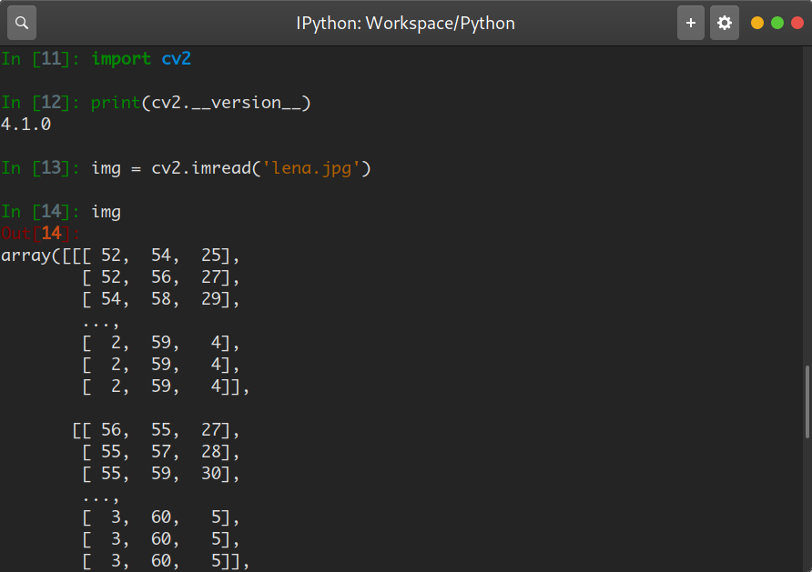

# 工作日志

组别：A09

姓名：刘晓飞

学号：2016012863

专业：计算机科学与技术

日期：2019年07月01日

---

## 一、工作任务

- 实验环境配置 *keras*, *opencv*, *tensorflow*

1. 安装 *keras* : `sudo conda install keras`
2. 安装 *opencv* : `sudo pip install opencv-python`
3. 安装 *tensorflow*: `sudo conda install tensorflow-gpu`

## 二、工作完成情况

#### 测试安装环境

- 测试 *keras*

测试结果为


- 测试 *opencv-python*

测试源代码如下：

```python
import cv2
print(cv2.__version__)
lena = cv2.imread('lena.jpg')
```

在交互式环境中 (ipython)中结果如下：



- *tensorflow*

在之前的学习中，实验环境已经安装成功。

## 三、项目进度与遇到的问题

小组成员均安装成功且测试成功，在按装 *opencv-python* 时需要换源，否则速度非常慢。查阅相关 *opencv-python*, *keras* 的资料和相关基本知识。

## 四、问题相关的解决方法

配置 *pip* 镜像源的命令为 `pip config set global.index-url https://pypi.tuna.tsinghua.edu.cn/simple`。另外在使用 `conda` 命令时经常忘记使用 `sudo` 提升权限，导致安装失败。